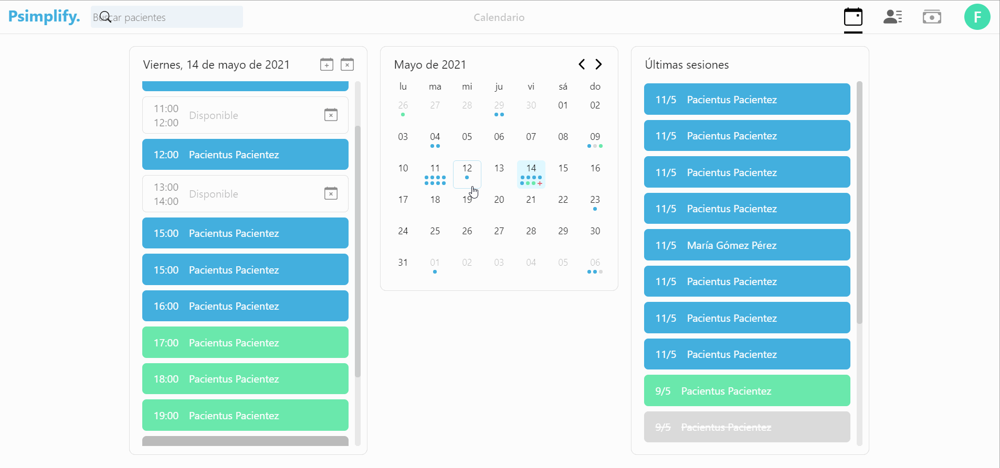

<h1 align="center">
  <br>Psimplify's front end
</h1>

<h3 align="center">A Scalable Cloud Native Web App for Therapists</h4>
<br>
<div align="center">


</div>
<br>
<p align="center">
  <a href="#usage">Usage</a> •
  <a href="#about">About</a> •
  <a href="#features">Features</a> •
  <a href="#design">Design</a> •
  <a href="#infrastructure">Infrastructure & CD</a> •
  <a href="#framework">Framework</a>
</p>

---

This is the front-end to [this back-end repo](https://github.com/fbgoode/psimplify-b).

<br>

## Usage

### Check out the live demo at [www.psimplify.es](https://www.psimplify.es).

### Or run the development server locally:
1. Clone repo and install dependencies (npm required)
```
git clone https://github.com/fbgoode/psimplify-f.git
cd psimplify-f
npm i
```
2. Start the NextJS development server:
```
npm run dev
```
NOTE: For the app to work in development mode, a backend development server running on the same machine is needed. [See here](https://github.com/fbgoode/psimplify-b#run-development-server-locally).

The app is now accessible in localhost:3000.

<br/>

## About

<table>
<tr>
<td>
<br>

**Psimplify** is the definitive solution for independent psychologists and therapists. This cloud-based service helps therapists with organization and productivity so they can spend more time on what matters. People.

</td>
</tr>
</table>

<br>



<br><br>

## Features
Current features include:
* Responsive design
* Registration with e-mail confirmation
* Log in/out securely with Amazon Cognito
* Reset password if forgotten
* CRM to save patient data
* Calendar with disponibility management
* Appointment generation
* View recent appointments

Future features ([see figma project](https://www.figma.com/file/Xg7m3nJx8LR5hVGa0gS1kd/Psimplify?node-id=98%3A1069)):
* Update profile
* Appointment statuses
* Add notes and attach files to appointments
* Patient search
* Patient history manager
* Add files
* Patient facing view to book appointments in therapist's abailable time slots through dinamically-generated patient specific url
* Vouchers and payment balance management
* Financial insights
* Invoice generation
* Self-registration mobile app for patient progress control

<br>

## Design

The app functionality was decided with the input of a psycologist with 5 years of experience as an independent professional. Iterations in the initial UI-UX design were done in collaboration with the therapist as well.

Figma was used during the design process.
[Check out the Figma project here](https://www.figma.com/file/Xg7m3nJx8LR5hVGa0gS1kd/Psimplify?node-id=98%3A1069).

The design is desktop-first but adapts seemlessly to tablets and smartphones.

<br>

## Infrastructure

The front end is hosted and served as static html, css and js by AWS Amplify through CDN. 

Amazon Amplify enables **Continuous Delivery** of this app. Commits to the main branch of this repo are automatically deployed to production at psimplify.es.

<br>

## Framework
**Next.js** is a **ReactJs** framework supported and used by some of the biggest tech companies in the world, such as Netflix or Twitch. It was chosen for this project because of the many features it adds on top of React, but mostly because of it's easy routing functionality and incremental page loading capabilities, which could work well with future planned features.

**Redux** was used for app-wide state management and persistence.

The **Ant-design** library is used to achieve a high quality UI experience with few resources.

Finally, **Amplify**'s library is used for API calls and a robust integration with Amazon Cognito for authentication.

<br>